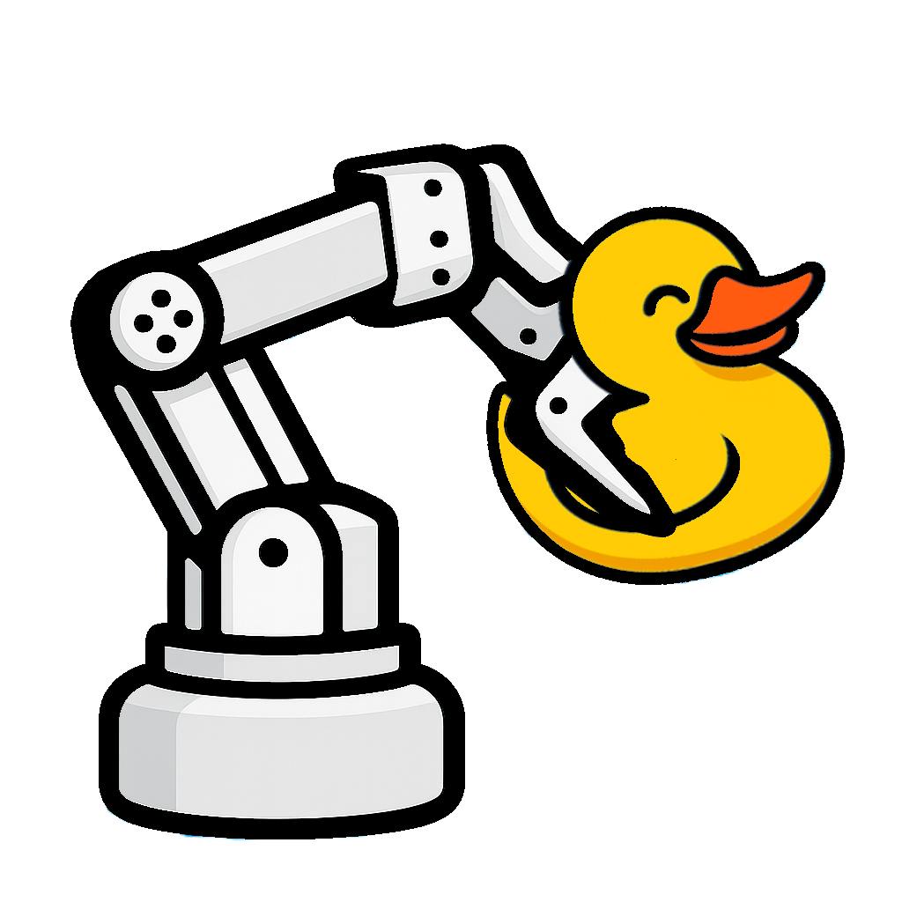

<picture></picture>

# Python, a robot and a rubber duckie

Companion repo for the talk **"Robótica accesible con Python y un patito de goma: de lo básico al aprendizaje por inteligencia artificial"** at [PyConEs2025](https://2025.es.pycon.org/), by [Manuel Heredia Ortiz](https://www.linkedin.com/in/manuelheredia/) and [Manuel Martin Mairal](https://www.linkedin.com/in/manuel-m-43b724142/)

## Contents

* [About the talk and the authors](./about.md)
* [Installation](./installation.md)
* [Quick start](quickstart.md)
* [Training ACT](./training_act.md) - with the corresponding
  * [ACT Collab training notebook](./notebooks/training_act.ipynb)
  * [ACT pretrained policy](https://huggingface.co/mhered/my_act/tree/main)

* [Training SmolVLA](./training_SmolVLA.md) - and the corresponding 
  * [SmolVLA Collab training notebook](./notebooks/training_smolvla.ipynb)

  * [SmolVLA pretrained policy](https://huggingface.co/mhered/my_smolvla/tree/main)

* [mhered/recording-test](https://huggingface.co/datasets/mhered/recording-test) dataset - check it out in the [LeRobot Dataset Visualizer](https://huggingface.co/spaces/lerobot/visualize_dataset)

* [Weights & Biases dashboard](https://wandb.ai/spam-mhered-duckietown/lerobot/runs/6ijc76vf?nw=nwuserspammhered)

## Resources

* [LeRobot](https://huggingface.co/docs/lerobot/en/index)

* [mhered/my_SOARM](https://github.com/mhered/my_SO100ARM) repository

## Todo 

- [ ] add 3D printing & assembly
- [ ] add basic python instructions
- [ ] add ROS modeling etc
- [ ] add pics and videos recording datasets and inference
