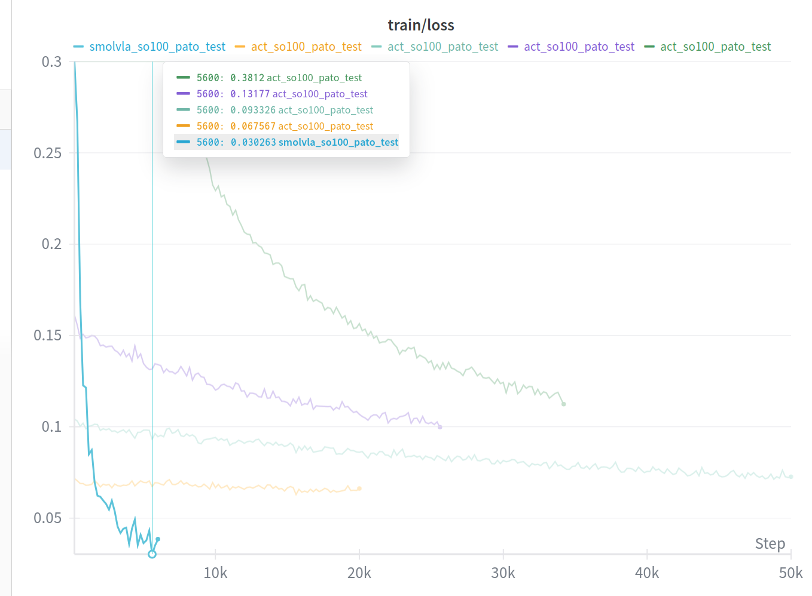

# Training SmolVLA

We can train SmolVLA policy using this [notebook](./notebooks/training_smolvla.ipynb) in Collab. This is based on the [original ACT training noebook](https://huggingface.co/docs/lerobot/en/notebooks#training-act) with some modifications of my own.

The notebook has cells to install conda, lerobot, set up wandb.ai, the huggingface hub, launch training and upload the pretrained policy checkpoints to 

Last checkpoint is uploaded to the HuggingFace Hub at [https://huggingface.co/mhered/my_smolvla/tree/main](https://huggingface.co/mhered/my_smolvla/tree/main)

Create an account in [Weight & Biases](http://wandb.ai) - google spam, organization Duckietown 

Note: Before running any cells, select A100 GPU runtime type (requires making a purchase, the cheapest option of 100 units pay as you go  for ~10€ will be plenty. 1-2hrs of training expected).

